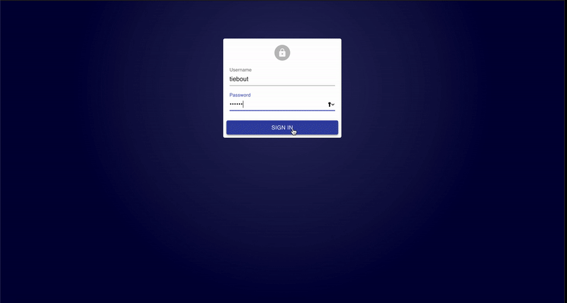

# </> tiebout world 개발 요약

## 웹사이트

## 기술

- React / React-Admin
- node.js / express
- mongoDB
- REST API
- AWS ec2 Linux / Route 53

## 기능

- 토큰 쿠키
- admin CRUD
- 비밀번호 되찾기 등 authentication
- footer, leader, admin 등 authorization

## 사진

